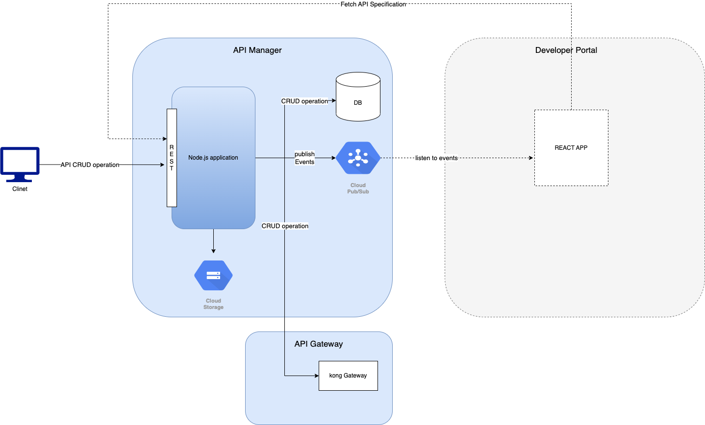
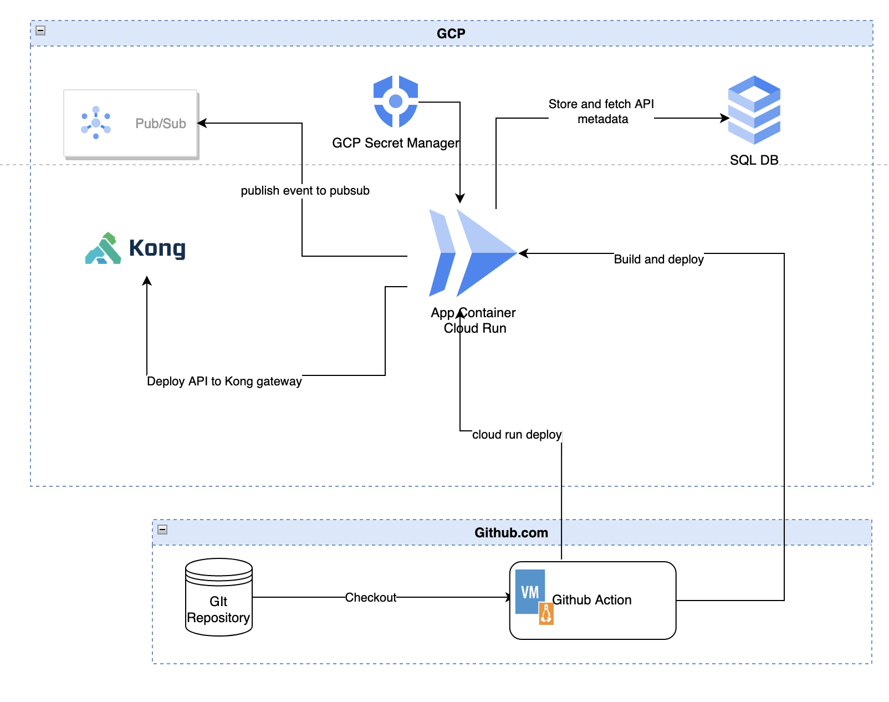

# API management soluton with Kong OSS gateway

The purpose of this application is to build a lightweight API management solution with Kong OSS gateway, an REST based application to manage API deployment related operations (CRUD), API subscription related operation (CRUD) and a REACT based developer portal to show API Specification. 
The code base here covers the API Gateway installation and setup and nodejs application to manage API deployment and subscription.

<div align="center">
    
</div>


## Application Component Diagram:

<div align="center">
 
</div>

## GCP Set up
### Application Deployment and runtime
#### GCP Service Account Creation

* Create a service account for application deployment with below roles
    * Cloud Build Service Account 
    * Cloud Run Developer 
    * Service Account User 

* Create a service account for application runtime with below roles
    * Pub/Sub Publisher
    * Storage Object Admin
    * Secret Manager Secret Accessor 

####  Create a GCS Bucket

####  Create pubsub topic

#### Create a postgreSQL instance in cloud SQL

* add a postgres cloud sql instance with default or preffered configuration and enable public ip
* once the instance creation is completed allow all ip address (0.0.0.0/0) as allowed network (for quick testing setup, not recommended prod set up).
connect the sql instance from and postgresql client (e.g pgadmin 4) and run the db.sql script under db repository 

#### Create GCP Workload identity federation
 
📚 Read more : [GCP Workload Identity Federation for Github ](https://medium.com/google-cloud/how-does-the-gcp-workload-identity-federation-work-with-github-provider-a9397efd7158)

```
gcloud iam workload-identity-pools create "<POOL-NAME>" \
  --project="<PROJECT-ID>" \
  --location="global" \
  --display-name="<POOL-NAME>"
```

```
gcloud iam workload-identity-pools describe "<POOL-NAME>" \
  --project="<PROJECT-ID>" \
  --location="global" \
  --format="value(name)"
```

```
export WORKLOAD_IDENTITY_POOL_ID="projects/<PROJECT-ID>/locations/global/workloadIdentityPools/<POOL-NAME>"
```

```
gcloud iam workload-identity-pools providers create-oidc "<GCP-IDNETITY-PROVIDER-NAME>" \
  --project="<PROJECT-ID>" \
  --location="global" \
  --workload-identity-pool=<POOL-NAME>" \
  --display-name="<GCP-IDNETITY-PROVIDER-NAME>" \
  --attribute-mapping="google.subject=assertion.sub,attribute.actor=assertion.actor,attribute.repository=assertion.repository" \
  --issuer-uri="https://token.actions.githubusercontent.com"
```

```
gcloud iam service-accounts add-iam-policy-binding "SERVICE-ACCOUNT-PRINCIPAL" \
  --project="<PROJECT-ID>" \
  --role="roles/iam.workloadIdentityUser" \
  --member="principalSet://iam.googleapis.com/${WORKLOAD_IDENTITY_POOL_ID}/attribute.repository/Lagnashree/lightweight_api-management_kong-oss"
```

gcloud iam service-accounts add-iam-policy-binding "SERVICE-ACCOUNT-PRINCIPAL" \
  --project="devproject-372318" \
  --role="roles/iam.workloadIdentityUser" \
  --member="principalSet://iam.googleapis.com/${WORKLOAD_IDENTITY_POOL_ID}/attribute.repository/Lagnashree/lightweight_api-management_kong-oss"


### GCP Secret Manager
Create a secret manager called "runtime-secret" with below JSON secret value, replace the values in JSON payload with right data.
```
{
"POSTGRES_HOST":"",
"POSTGRES_PORT":"5432",
"POSTGRES_USERNAME":"",
"POSTGRES_PASSWORD":"",
"POSTGRES_DATABASE":"",
"BUCKET_NAME":"",
"KONG_ADMIN_TOKEN":"",
"KONG_ADMIN_URL":"",
"PUBSUB_TOPIC":"",
"GIT_TOKEN":""
}
```

## GIT SETUP
### Create GIT Secret
  
Create below GIT secret for GIT Hub Action:

* SA_RUNTIME_EMAIL
* SA_BUILD_DEPLOY
* VPC_CONNECTOR
* PROJECT_ID


## Kong OSS Installation

📚 Read more : [ kong installation in debian linux ](https://docs.konghq.com/gateway/latest/install/linux/debian/?_ga=2.260295373.1725644792.1672744681-1186856553.1671803909)

Here I have chosen GCP VM with Debian Linux to install the kong OSS version 3.0.x (Note this installation is not ready for production use but to set up a quick kong GW to demo. This installation is not suitable for production use)

### Step 1
In GCP console create a VM with below details
Allow TCP 8001 PORT in network firewall
    
### Step 2:
Logged into VM and ran below steps. It would install required dependency and download kong binaries and install the package

```
sudo apt update && sudo apt upgrade &&
sudo apt install curl &&
sudo apt install lsb-release &&
curl -Lo kong-enterprise-edition-3.0.1.0.all.deb "https://download.konghq.com/gateway-3.x-debian-$(lsb_release -cs)/pool/all/k/kong-enterprise-edition/kong-enterprise-edition_3.0.1.0_amd64.deb" &&
sudo dpkg -i kong-enterprise-edition-3.0.1.0.all.deb
``` 

### Step 3:
set up a postgres DB for kong Gateway and Provision a database and a user 

```
CREATE USER kong WITH PASSWORD 'super_secret'; CREATE DATABASE kong OWNER kong;
```

### Step 4
Setup config

```
sudo cp /etc/kong/kong.conf.default /etc/kong/kong.conf
```

open the /etc/kong/kong.conf and add below lines

```
sudo vi /etc/kong/kong.conf
pg_user = kong
pg_password = password you set
pg_database = kong
pg_host= pg host 
admin_listen = 0.0.0.0:8001
```

Run below command the do the complete configuration 

```
sudo kong migrations bootstrap -c /etc/kong/kong.conf
```

start the kong gateway 

```
kong start -c /etc/kong/kong.conf
```

Verify the installation

```
curl -i http://localhost:8001
```

## To run the application locally 

to setup local environment follow below step:

* intall kong deck tool in local machine https://docs.konghq.com/deck/1.12.x/installation/
* git clone the repo.
* In conf folder create a folder called gcpKeys  and place a service account key file with name dev.json (with required runtime access as mentioned above)
* create a .env file in top root directory and place below values

```
GCP_PROJECT_ID=<gcp project id>
GOOGLE_APPLICATION_CREDENTIALS=./conf/gcpKeys/dev.json
```

* run 'npm install'
* run 'npm run start'
